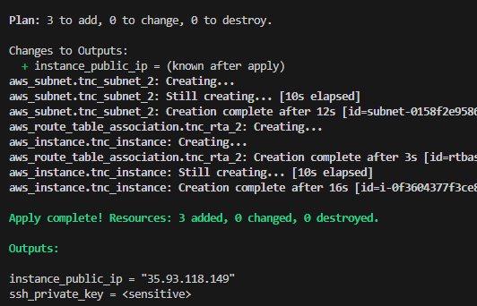
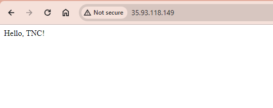
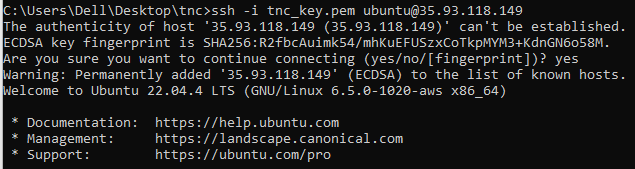

# Terraform to AWS Deployment 

This Terraform project creates a VPC, 2 subnets, and an EC2 instance running an Apache web server that serves a static HTML page on port 80 that returns the text ‘Hello, TNC!’. Port 22 is open only to an allowed IP, you can add your IP on terraform.tfvars. It also generates an SSH key pair, stores it in AWS Secrets Manager, and uses it to access the EC2 instance.

## Prerequisites

- Terraform installed on your local machine ( confirm using `terraform -v` on your cmd prompt)
- AWS CLI installed and configured with administrator access(optional)

## How to Run this Project

1. **Clone the repository:**
    ```sh
    git clone https://github.com/juliana115/tnc_infra_terraform.git
    cd tnc_infa_terraform
    ```

2. **Authenticate to AWS by exporting your Environment variable**
  
    ```sh
    export AWS_ACCESS_KEY_ID="your_access_key_id"
    export AWS_SECRET_ACCESS_KEY="your_secret_access_key"
    export AWS_DEFAULT_REGION="us-west-2"
   
    ```

3. **Initialize Terraform:**
    ```sh
    terraform init
    ```

4. **Plan the infrastructure:**
    ```sh
    terraform plan
    ```

5. **Apply the configuration:**
    ```sh
    terraform apply
    ```

6. **Access the web server:**
    After the apply command completes, you will see the public IP address of the EC2 instance in the output. Open a web browser and go to `http://<instance_public_ip>`. You should see the message ‘Hello, TNC!’.

7. **Retrieve SSH private key:**
    To retrieve the private key from AWS Secrets Manager, you can use the AWS CLI(if installed):
    ```sh
    aws secretsmanager get-secret-value --secret-id <key_name>_secret --query SecretString --output text
    ```
    Save this key to a file (e.g., `tnc_key.pem`) and set the permissions:
    ```sh
    chmod 400 tnc_key.pem
    ```

    If CLI isnt installed you can also retrieve this from AWS Managemnt console
     - login to AWS console 
     - Search for Secret manager
     - select the secret named `tnc_keypair_secret`
     - copy and save to a file on local using .pem extension
     - ensure to change file permission ` chmod 400 tnc_key.pem`


8. **SSH into the instance:**
    Use the private key to SSH into the instance:
    ```sh
    ssh -i tnc_key.pem ubuntu@<your instance_public_ip>
    ```

## Files

- **main.tf**: Main Terraform configuration file.
- **variables.tf**: Variable definitions.
- **terraform.tfvars**: Variable values.
- **provider.tf**: AWS provider configuration.
- **output.tf**: Outputs of the Terraform project.
- **README.md**: This file.

## Deployment Images
Complete Deployment:



Access the web


Successfull SSH from Allowed IP


## Notes

Ensure the AMI ID in `main.tf` with your preferred version, this project uses ubuntu 22.04 AMI for the `us-west-2` region.
Ref: [Find AMI for EC2 ](https://cloud-images.ubuntu.com/locator/ec2/)
